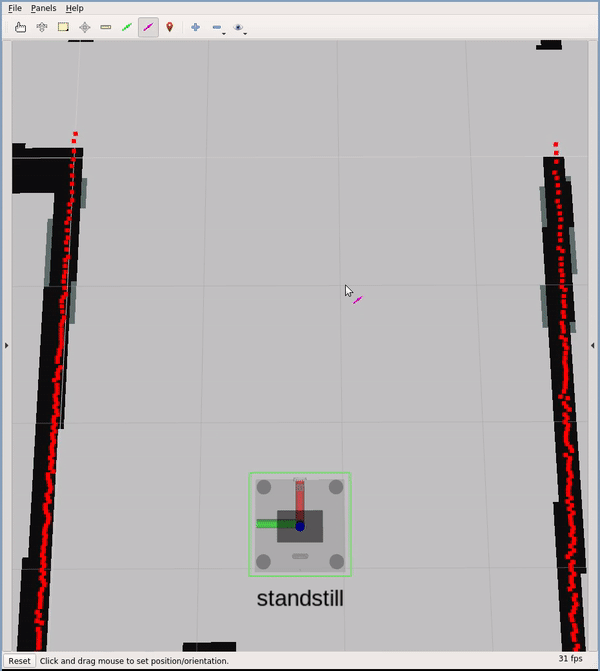

# CABIN Nav

**C**ontext **A**ware **B**ehavior-based **IN**door **NAV**igation

The robot uses different behaviors based on its current context to achieve a
task. The context consists of sensor data and **semantic map**. 

 <p float="left">
  
   
</p>

This is a down-sized version of my Master's thesis project. Full version could
- transport a cart ([youtube](https://youtu.be/vp-CY13f3D8))
- sweep an area ([youtube](https://youtu.be/Df7EnYdpkkw))

However, only `goto` action was allowed to be open-sourced.

## Dependency

- [geometry\_common](https://github.com/kelo-robotics/geometry_common)
- [yaml\_common](https://github.com/kelo-robotics/yaml_common)
- For simulation [ropod\_sim](https://github.com/DharminB/ropod_sim)(optional)

On Ubuntu 20.04 with ROS Noetic, install the package `python-is-python3` using
the below command to avoid runtime errors when launching python-based ROS nodes 
```sh
sudo apt install python-is-python3
```

## Usage

#### Simulation

- Launch simulation
```sh
roslaunch cabin_nav sim.launch
```

- Launch CABIN Navigation
```
roslaunch cabin_nav cabin_navigator.launch
```

- Then publish a 2D nav goal in RViz.
- Optionally, one can also publish a task request message
  - For `goto` action

    ```sh
    rostopic pub /cabin_navigator/task_request std_msgs/String "data: '{task_type: goto, goal: {x: 62.7, y: 31.7, theta: 3.14}}'" -1
    ```

### Test

```sh
catkin build --this --catkin-make-args run_tests -- && rosrun cabin_nav cabin_nav_test
```
